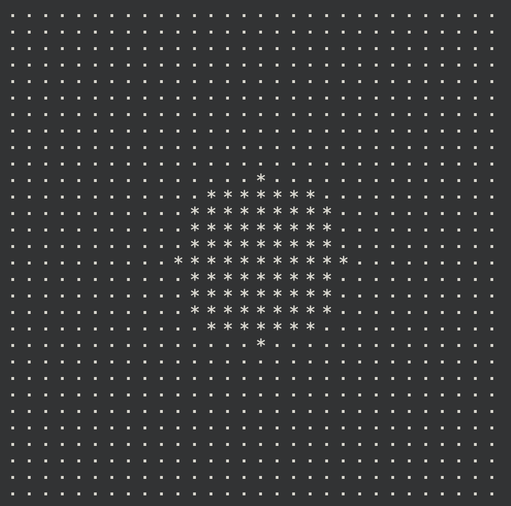

# Soft Processing Unit (SPU)

## О проекте
Данный проект реализует программный стековый процессор и транслятор из собственного языка ассемблера в исполняемый файл.

## Установка и сборка

### Требования
- Компилятор C++
- Make

Сначала склонируйте репозитирий к себе в систему и подгрузите сабмодули:
```bash
git clone git@github.com:whiterno/spu.git
git submodule update --init --recursive
```

В корневой папке проекта находится `Makefile`, поэтому для компиляции нужно просто воспользоваться командой:
```bash
make <target>
```

| target    |  Описание работы                             |
| :-------: | :------------------------------------------: |
| assembly  | Компиляция и запуск кода для ассемблирования |
| compile   | Компиляция кода процессора                   |
| run       | Запуск процессора                            |

Если вы хотите сразу запустить программу, можете прописать:
```asm
make all
```

## Работа с ассемблером

Ассемблеровские команды будут считываться с файла inter_cmds.asm. Пример программы, которая считывает переменную с терминала, умножает ее на 2 и выводит:
```asm
IN
POP AX

PUSH AX
PUSH 2
MULT
POP AX

PUSH AX
OUT
```

| Команда |  Аргументы                                                                    | Описание работы                      |
| :-----: | :---------------------------------------------------------------------------: | :----------------------------------: |
| HLT     | -                                                                             | Завершение исполнения                |
| PUSH    | IMM / REG / IMM + REG / REG + IMM / [IMM] / [REG] / [IMM + REG] / [REG + IMM] | Записывает значения аргумента в стек |
| POP     | REG / [IMM] / [REG] / [IMM + REG] / [REG + IMM]                               | Забирает из стека значение в аргумент|
| ADD     | -                                                                             | Сложение 2 значений из стека и сохранение в стеке |
| SUB     | -                                                                             | Вычитание 2 значений из стека и сохранение в стеке |
| MULT    | -                                                                             | Умножение 2 значений из стека и сохранение в стеке |
| DIV     | -                                                                             | Деление 2 значений из стека и сохранение в стеке |
| IN      | -                                                                             | Ввод значения из консоли в стек      |
| OUT     | -                                                                             | Вывод значения из стека в консоль    |
| JMP     | label / IP                                                                    | Переход по метке                     |
| JA      | label / IP                                                                    | Переход, если больше                 |
| JAE     | label / IP                                                                    | Переход, если больше или равно       |
| JB      | label / IP                                                                    | Переход, если меньше                 |
| JBE     | label / IP                                                                    | Переход, если меньше или равно       |
| JE      | label / IP                                                                    | Переход, если равно                  |
| JNE     | label / IP                                                                    | Переход, если не равно               |
| DRAW    | -                                                                             | Вывод видепамяти в консоль           |
| CALL    | function name                                                                 | Вызов функции                        |
| RET     | -                                                                             | Возврат из функции                   |
| SQRT    | -                                                                             | Квадратный корень значения из стека и сохранения в стек |


Все переходы сравнивают 2 верхних значения из стека. Например:
```asm
PUSH 1
PUSH 2
JA .L1:
PUSH 2
OUT
.L1:
PUSH 1
OUT
```
Эта программа выведет 2 и 1, так как условие того, что 1 > 2 ложно. Переход не произошел.

В конце меток обязательно надо прописывать `:`, как и в названии функций.

## Примеры программ

В репозитории хранятся примеры 3 программ:
- **factorial.asm** - рекурсивное высчитывание факториала
- **quadr.asm** - решение квадратного уравнения в целых числах
- **circle.asm** - отрисовка круга в терминале выводом из видеопамяти

<p align="center"> </p>

## Реализация

Транслятор проходит код только один раз и сохраняет имена меток в специальный массив, приписывая к ним адрес сразу, если они встречаются до своего вызова. Если же происходит переход вперед, то сначала в массиве хранится стандартное значение, показывающее, что метка не инициализирована, а после дополняется адресом.

При вызове функций их адреса сохраняются в отдельный стек, что позволяет правильно завершать работу и возвращаться в запланированное место даже при захламленности стека данных.
